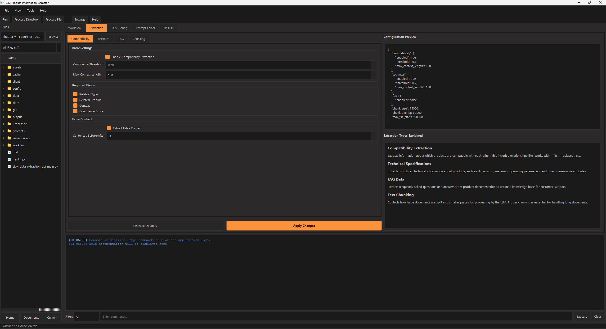
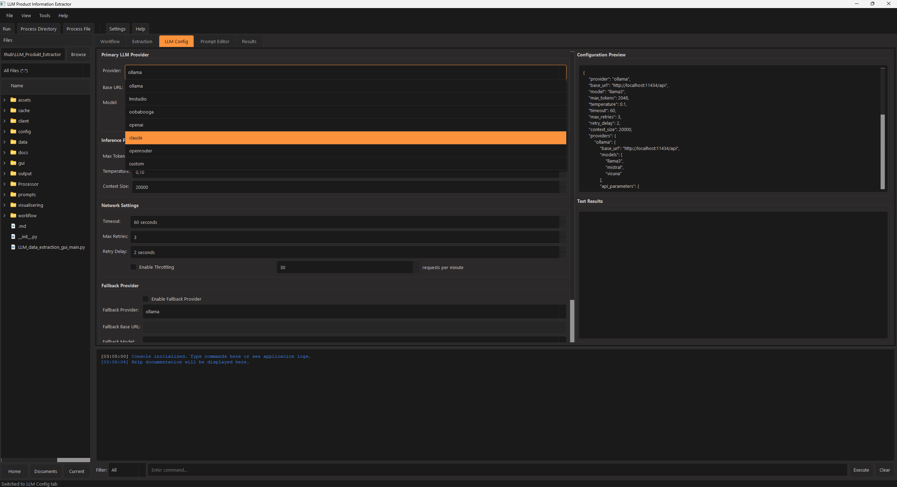
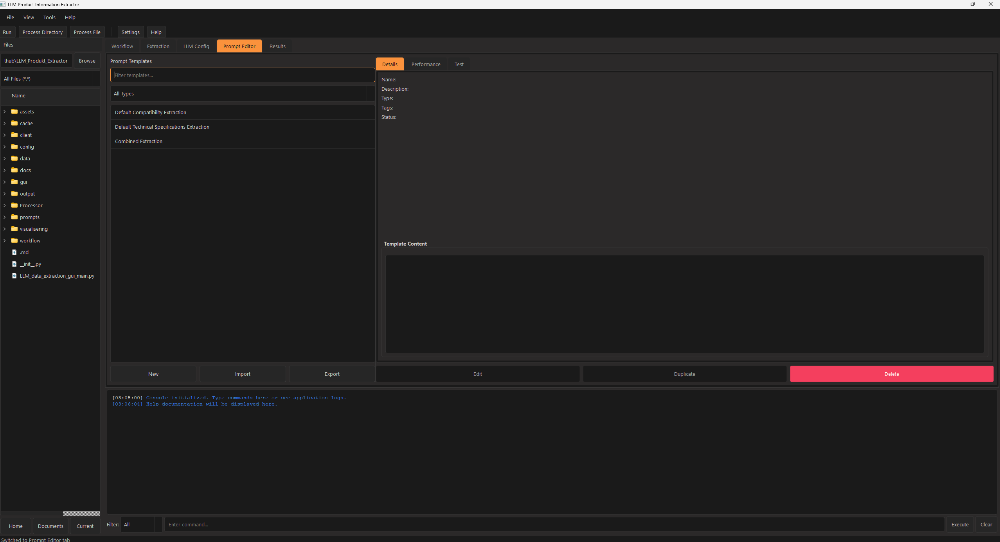
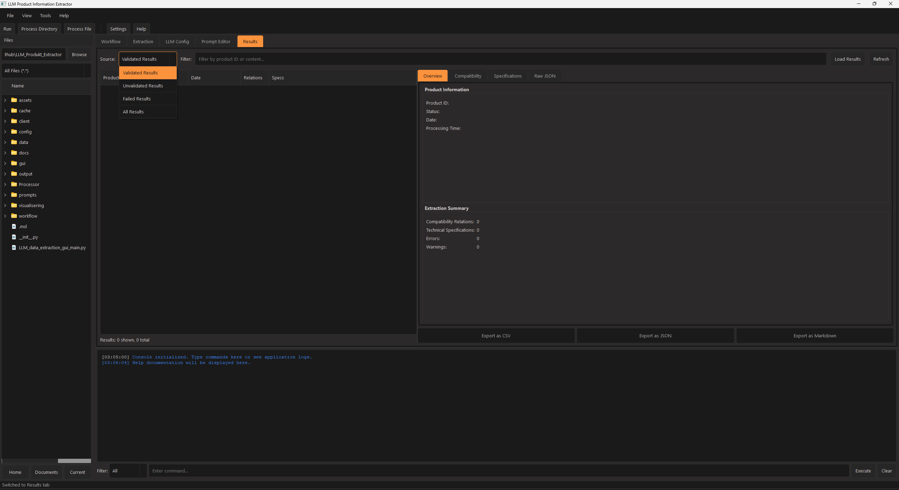

# LLM Product Information Extractor – Developer README

Welcome to the LLM Product Information Extractor project. This repository contains a Python-based system designed to extract structured product information from documentation using large language models (LLMs). The system is modular, scalable, and designed with robust workflow management, error handling, and flexible extraction strategies.

---

## Table of Contents

- [Overview](#overview)
- [Key Features](#key-features)
- [Architecture Overview](#architecture-overview)
- [Project Structure](#project-structure)
- [Installation and Setup](#installation-and-setup)
- [Running the Application](#running-the-application)
- [Development Guidelines](#development-guidelines)
- [Testing](#testing)
- [Contributing](#contributing)
- [License](#license)

---

## Overview

The LLM Product Information Extractor is an end-to-end solution that:
- Reads product documentation files (e.g., Markdown)
- Processes and extracts product details using one or more LLMs
- Structures and validates the extracted data (compatibility relations, technical specifications, FAQ data)
- Organizes the output into structured files and generates reports
- Provides a graphical user interface (GUI) for real-time monitoring and control

This system is designed to be both flexible and robust, with support for parallel processing, scheduling, batch operations, and fallback LLM providers.

---

## Key Features

- **Modular Workflow Management:** A central `WorkflowManager` orchestrates the overall process, handling job scheduling, parallel processing, and error recovery.
- **Product Processing:** The `ProductProcessor` class manages file reading, LLM-based extraction, validation, and result merging.
- **LLM Client Integration:** The `LLMClient` module supports multiple LLM providers (Ollama, LM Studio, OpenAI, Claude, OpenRouter, etc.) and includes robust error handling with exponential backoff and fallback options.
- **GUI Application:** Built with PySide6, the GUI offers a tabbed interface with views for workflow management, extraction configuration, LLM settings, prompt editing, and result visualization.
- **Batch and Directory Processing:** The system can process individual files, entire directories, or CSV file lists, grouping products into manageable batches.
- **Extensible and Configurable:** All extraction strategies, thresholds, caching, and parallelism settings are configurable via YAML/JSON configuration files.

---

## Architecture Overview

The system is organized into several key modules:

- **Workflow Module:**  
  Contains job management and scheduling classes such as `ProcessingQueue`, `JobScheduler`, and `Worker`. This layer ensures that product processing jobs are queued, prioritized, and executed in parallel.

- **Processor Module:**  
  The heart of the extraction logic is in the `ProductProcessor` class, which reads product documentation, manages chunking for large files, calls the LLM client for extraction, validates the results, and saves both raw and structured data.

- **Client Module:**  
  The `LLMClient` and its provider classes (e.g., `OllamaProvider`, `LMStudioProvider`, `OpenAIProvider`, etc.) manage communication with external LLM services. This module also includes the `ChunkManager` for splitting large texts and the `ResponseParser` for handling and validating LLM outputs.

- **GUI Module:**  
  Built with PySide6, the GUI is organized in tabs and docked panels. It provides a user interface for managing workflows, editing prompts, configuring LLM settings, browsing files, and viewing results.

- **Prompts Module:**  
  Contains prompt templates and logic for dynamic prompt optimization and caching. It allows for fine-tuning extraction requests based on the product type and extraction requirements.

---

## Project Structure

Below is a high-level view of the repository structure:

```
/client
    LLMClient.py              # LLM client and provider classes
/config
    ConfigManager.py          # Handles configuration loading and updates
/gui
    main_window.py            # Main application window using PySide6
    /panels                  # Additional UI panels (console, file explorer, etc.)
    /tabs                    # Tab views (workflow, extraction, LLM config, etc.)
/Processor
    ProductProcessor.py       # Core product processing logic
/workflow
    Arbetsflödeshantering.py  # Workflow management and job scheduling
/prompts
    PromptTemplate.py         # Base prompt templates and default prompts
    ExtractionPrompt.py       # Extraction-specific prompt templates
    ...                       # Additional prompt-related modules
```

Each module is designed to be self-contained, and the code is organized to promote maintainability, scalability, and efficient parallel processing.

---

### **Installation and Setup in PowerShell**
#### 1. **Clone the Repository**
```powershell
git clone https://github.com/rewnozom/llm-product-info-extractor.git
cd llm-product-info-extractor
```

#### 2. **Create and Activate a Virtual Environment**
```powershell
python -m venv venv
venv\Scripts\Activate
```

#### 3. **Install Dependencies**
```powershell
pip install -r requirements.txt
```

#### 4. **Configuration**
- Ensure you have API keys set for your LLM providers (e.g., OpenAI, Anthropic) via the configuration file or environment variables.

---

### **Running the Application**

#### **Run the GUI Application**
```powershell
python LLM_data_extraction_gui_main.py
```
