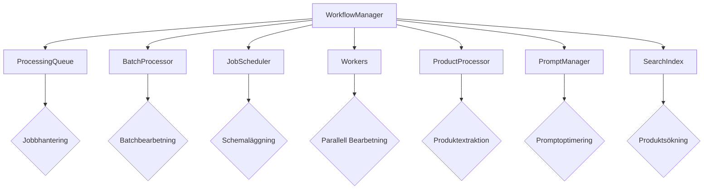
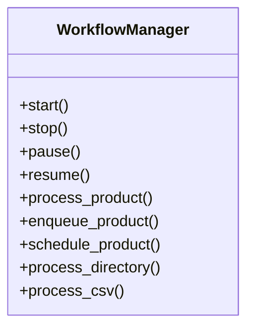
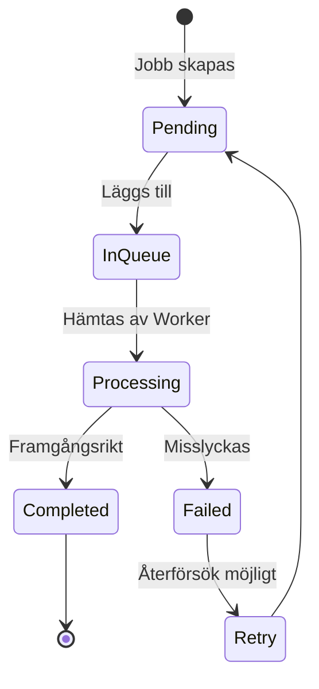
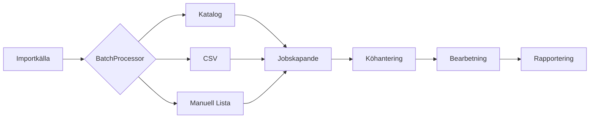
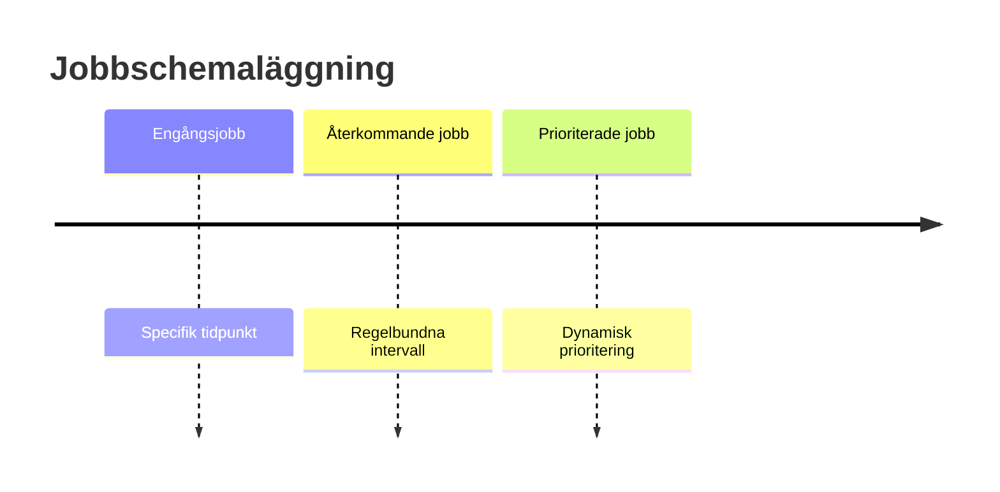
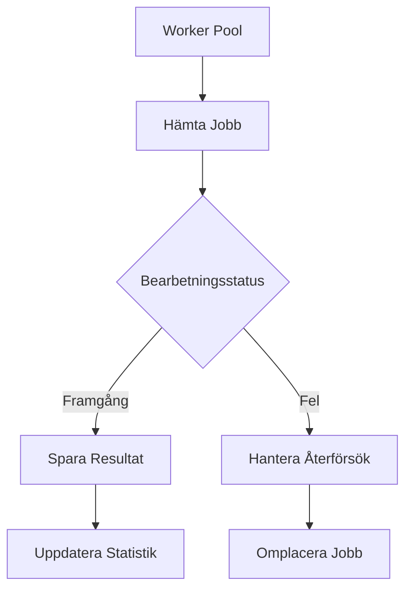
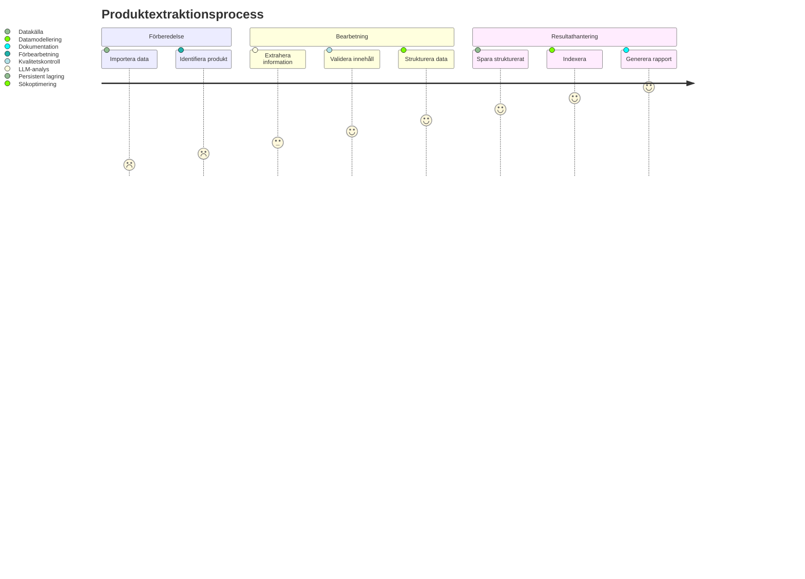
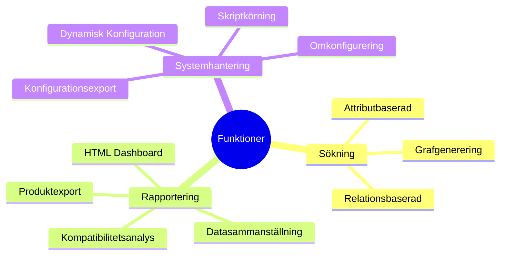

# Moduldokumentation för LLM-baserad Produktinformationsextraktor

## Övergripande Systemöversikt

Systemet är designat för flexibel, robust och skalbar bearbetning av produktdata genom flera sammankopplade komponenter.

## Kärnkomponenter

### 1. WorkflowManager
Central hanterare som koordinerar alla systemkomponenter och arbetsflöden.

### 2. ProcessingQueue
Hanterar jobb med prioritering och trådsäker köhantering.

### 3. BatchProcessor
Möjliggör massbearbetning av produkter från olika källor.

### 4. JobScheduler
Schemalägger och hanterar jobb över tid.

### 5. Workers
Parallella bearbetningsenheter för produktextraktion.

## Nyckelarkitekturprinciper

1. **Trådsäkerhet**: Implementerad genom låsmekanismer och koordinerade operationer
2. **Flexibel Prioritering**: Dynamisk jobbprioritering
3. **Robust Felhantering**: Återförsöksmekanismer och detaljerad loggning
4. **Skalbarhet**: Oberoende komponenter möjliggör horisontell skalning

## Arbetsflödesstrategi

## Funktioner:

- Dynamisk promptoptimering
- Automatisk sökindexering
- Relationsgrafgenerering
- Automatiserad rapportering
- Konfigurerbar bearbetningskontext

## Säkerhets- och Prestandaöverväganden

1. Trådsäkra datastrukturer
2. Konfigurerbara timeouts
3. Mekanismer för mjuk nedstängning
4. Minneseffektiv bearbetning
5. Asynkron jobbhantering

## Skalbarhetspotential

- Horisontell skalning genom worker-pool
- Dynamisk resursallokering
- Stöd för distribuerad bearbetning
- Konfigurerbar parallellism

## Extensibility

Systemet är konstruerat med löst kopplade komponenter som möjliggör:
- Enkla tillägg av nya bearbetningsmoduler
- Anpassningsbara extraktionsstrategier
- Utbytbara underkomponenter

----

1. **Söknings- och Relationsfunktioner**
   - `query_products_by_attribute()`: Flexibel produktsökning
   - `query_products_with_relations()`: Relationsbaserad sökning
   - `find_related_products_graph()`: Generera produktrelationsgraf
   - `export_relation_graph()`: Exportera relationsdata

2. **Rapporterings- och Exportfunktioner**
   - `generate_html_dashboard()`: Interaktiv statusöversikt
   - `generate_data_report()`: Omfattande datasammanställning
   - `export_product_data()`: Detaljerad produktdataexport
   - `generate_compatibility_report()`: Kompatibilitetsanalys

3. **Konfigurations- och Systemhantering**
   - `update_config()`: Dynamisk konfigurationsuppdatering
   - `export_config()`: Konfigurationsexport
   - `reload_config()`: Omkonfigurering under körning
   - `execute_script()`: Skriptkörning i systemkontext

