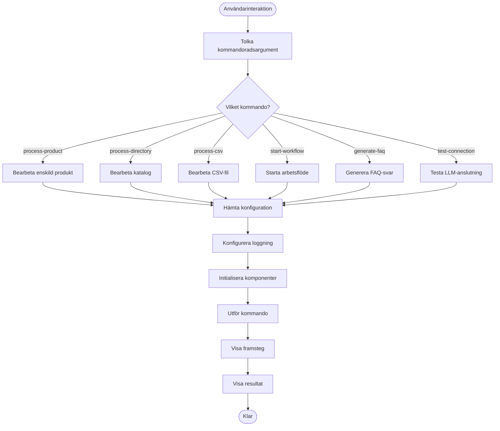

# Arbetsflödessammanfattningar för LLM-baserad Produktinformationsextraktor

## Övergripande arbetsflöde

1. **Inläsning av produktdata**: Systemet läser in produktbeskrivningar från markdown-filer
2. **Bearbetning med LLM**: Texten skickas till en lokal AI (LLM) som extraherar värdefull information
3. **Strukturering**: AI-svaren omvandlas till strukturerade data om kompatibilitet och specifikationer
4. **Validering**: Systemet kontrollerar att informationen är komplett och korrekt
5. **Lagring**: Resultaten sparas i strukturerade filer för enkel åtkomst
6. **Rapportering**: Systemet skapar detaljerade rapporter om det extraherade innehållet


## Start och konfiguration

1. **Läs konfiguration**: Ladda inställningar från config-filen
2. **Kontrollera LLM-tjänst**: Verifiera anslutning till lokal AI (Ollama, LM Studio, etc.)
3. **Skapa arbetsmiljö**: Förbered kataloger och loggning
4. **Initialisera komponenter**: Starta nödvändiga system


## Filbearbetning

1. **Kontrollera storlek**: Systemet avgör om filen behöver delas upp
2. **Delning (vid behov)**: Stora filer delas i mindre delar med överlappning
3. **LLM-bearbetning**: Varje del skickas till AI-tjänsten
4. **Sammanfogning**: Resultat från alla delar sammanställs till ett komplett resultat


## AI-interaktion

1. **Förbereda prompt**: Skapa en specialiserad instruktion till AI-modellen
2. **Skicka förfrågan**: Kommunicera med den lokala AI-tjänsten
3. **Hantera svar**: Tolka AI:ns svar och extrahera strukturerad information
4. **Felhantering**: Automatiska återförsök vid tillfälliga fel


## Parallell bearbetning

1. **Skapa jobbkö**: Bygg en kö med produkter att bearbeta
2. **Starta arbetare**: Initiera flera parallella bearbetningstrådar
3. **Fördelning**: Arbetare hämtar jobb från kön baserat på prioritet
4. **Statusspårning**: Övervaka framsteg och identifiera problem


## Batch-bearbetning

1. **Inläsning av produktlista**: Läs in en lista med produkter från katalog eller CSV
2. **Gruppering**: Dela upp produkter i hanterbara batcher
3. **Schemaläggning**: Lägg batcher i jobbkön med prioritet
4. **Rapportering**: Skapa batch-specifika rapporter


## Extrahering av kompatibilitetsinformation

1. **Specialiserad prompt**: Skicka en detaljerad förfrågan om produktkopplingar
2. **Tolkning**: Identifiera vilka produkter som är kompatibla med varandra
3. **Kvalitetskontroll**: Filtrera bort osäkra kopplingar
4. **Strukturering**: Organisera information i användbart format


## Extrahering av tekniska specifikationer

1. **Teknisk prompt**: Skicka en förfrågan om produktens tekniska egenskaper
2. **Kategorisering**: Gruppera specifikationer i kategorier (dimensioner, elektriska, etc.)
3. **Standardisering**: Normalisera enheter och värden
4. **Validering**: Kontrollera fullständighet och rimlighet


## FAQ-svarsgeneration

1. **Frågeanalys**: Identifiera vilken typ av information som efterfrågas
2. **Datahämtning**: Hämta relevanta extraherade data
3. **Svarsformatering**: Skapa ett strukturerat och informativt svar
4. **Formatering**: Presentera svaret i läsbart format


## Felhantering och återhämtning

1. **Felidentifiering**: Upptäck problem under bearbetningen
2. **Kategorisering**: Avgör typ av fel och allvarlighetsgrad
3. **Återhämtning**: Implementera lämplig återhämtningsstrategi
4. **Loggning**: Spåra fel för senare analys


## Rapportering och analys

1. **Datainsamling**: Samla statistik från bearbetning
2. **Visualisering**: Skapa visuella sammanställningar
3. **Detaljanalys**: Generera djupgående rapporter
4. **Export**: Spara data i läsbara format (JSON, Markdown)


## Användarinteraktion via CLI

1. **Kommandotolkning**: Tolka användarens kommando och argument
2. **Konfiguration**: Läs och tillämpa konfigurationsalternativ
3. **Feedback**: Ge användaren återkoppling om framsteg
4. **Resultatpresentation**: Visa och spara resultat på begärt sätt




Här är fler arbetsflödessammanfattningar och mermaid-diagram som täcker resterande aspekter av systemet:

## Kontinuerlig bearbetning

1. **Katalogövervakning**: Systemet övervakar en katalog för nya jobbfiler
2. **Automatisk upptäckt**: Nya jobb läggs automatiskt till i kön
3. **Statusuppdatering**: Periodiska statusuppdateringar visas i terminalen
4. **Tillståndsbevarande**: Jobbtillstånd sparas för att klara omstarter


## Produktidentifikation och normalisering

1. **Extrahering av produktidentifierare**: Systemet upptäcker produkt-ID och artikelnummer
2. **Standardisering**: Produktnamn formateras enhetligt
3. **Uppslag**: Relaterade produkter matchas mot kända produktdatabaser
4. **Referensvalidering**: Kontrollera att produktreferenser är giltiga


## Schemaläggning och prioritering

1. **Prioritetsklassificering**: Jobb kategoriseras efter prioritet
2. **Tidsberoende schemaläggning**: Jobb kan schemalaggas för framtida körning
3. **Dynamisk omprioritering**: Prioriteter kan justeras baserat på systembelastning
4. **Resursallokering**: CPU och minnestilldelning baserat på jobbprioritet


## Throttling och belastningshantering

1. **Begränsning av LLM-anrop**: Kontrollerad takt för förfrågningar till LLM-tjänsten
2. **Övervakning av systemresurser**: Mätning av CPU, minne och nätverksutnyttjande
3. **Dynamisk justering**: Anpassning av bearbetningstakten baserat på aktuell belastning
4. **Backoff-strategier**: Exponentiell ökning av väntetid vid tjänstebegränsningar


## Validering och kvalitetskontroll

1. **Schemakontroll**: Verifiering att extraherad data följer förväntad struktur
2. **Innehållsvalidering**: Kontroll av att innehållet är rimligt och konsekvent
3. **Förtroendefiltrering**: Filtrering baserat på LLM:s förtroende för extraherad information
4. **Korrigeringsåtgärder**: Automatiska försök att rätta till problem


## Datalagring och filhantering

1. **Strukturerade format**: Lagring av extraktion i JSON och andra strukturerade format
2. **Katalogorganisering**: Organisering av filer i logiska katalogstrukturer
3. **Versionshantering**: Spårning av ändringar över tid
4. **Säkerhetskopiering**: Automatisk säkerhetskopiering av viktiga data


## Återhämtning vid systemkrasch

1. **Tillståndsspårning**: Kontinuerlig loggning av systemets tillstånd
2. **Checkpoint-skapande**: Regelbunden lagring av säkra tillståndspunkter
3. **Återställning**: Process för att återställa systemet efter krasch
4. **Återupptagning**: Förmåga att fortsätta bearbetning från senaste säkra punkt


## API-integrering

1. **Endpoint-konfguration**: Konfigurering av API-ändpunkter för externa system
2. **Datapublicering**: Tillgängliggörande av extraherad information via API
3. **Verifieringsflöde**: Kontroll av behörighet och datakvalitet
4. **Svarsgenerering**: Struktureringav API-svar


## Nyckelterm-extraktion

1. **Termidentifiering**: Upptäckt av viktiga termer i produktdokumentation
2. **Begreppsklassificering**: Kategorisering av termer (produktnamn, egenskaper, tekniska termer)
3. **Relationsanalys**: Spårning av hur termer relaterar till varandra
4. **Lexikonbyggande**: Skapande av produktspecifik ordlista

```mermaid
flowchart TD
    Start([Start termextraktion]) --> TokenizeText[Tokenisera text]
    TokenizeText --> IdentifyTerms[Identifiera potentiella termer]
    IdentifyTerms --> FilterCommon[Filtrera vanliga ord]
    FilterCommon --> ClassifyTerms[Klassificera termer]
    
    ClassifyTerms --> ProductNames[Produktnamn]
    ClassifyTerms --> TechnicalTerms[Tekniska termer]
    ClassifyTerms --> FeatureTerms[Egenskapstermer]
    
    ProductNames --> AnalyzeCooccurrence[Analysera samförekomst]
    TechnicalTerms --> AnalyzeCooccurrence
    FeatureTerms --> AnalyzeCooccurrence
    
    AnalyzeCooccurrence --> BuildRelationGraph[Bygg relationsgraf]
    BuildRelationGraph --> CalculateImportance[Beräkna termviktighet]
    CalculateImportance --> FilterByRelevance[Filtrera efter relevans]
    
    FilterByRelevance --> BuildLexicon[Bygg produktlexikon]
    BuildLexicon --> LinkToProducts[Länka till produkter]
    LinkToProducts --> End([Klar])
```

## Visualisering av kompatibilitetsrelationer

1. **Dataförberedelse**: Bearbetning av extraherad information för visualisering
2. **Grafgenerering**: Skapande av kompatibilitetsgraf
3. **Nodkategorisering**: Färgkodning och gruppering av produkter
4. **Exportformat**: Generering av grafer i olika format (SVG, HTML, etc.)

```mermaid
flowchart TD
    Start([Start visualisering]) --> PrepareData[Förbereda kompatibilitetsdata]
    PrepareData --> BuildGraph[Skapa relationsgraf]
    BuildGraph --> ClassifyNodes[Klassificera noder]
    ClassifyNodes --> ColorCodeRelations[Färgkoda relationer]
    
    ColorCodeRelations --> ApplyLayout[Tillämpa graflayout]
    ApplyLayout --> AddLegend[Lägg till förklaring]
    AddLegend --> AddMetadata[Lägg till metadata]
    
    AddMetadata --> GenerateSVG[Generera SVG]
    GenerateSVG --> GenerateHTML[Generera interaktiv HTML]
    GenerateHTML --> OptimizeSize[Optimera filstorlek]
    
    OptimizeSize --> ExportFiles[Exportera filer]
    ExportFiles --> End([Klar])
```

## Systemövervakning och diagnostik

1. **Prestandamätning**: Insamling av prestandarelaterade mätvärden
2. **Hälsokontroll**: Regelbundna kontroller av systemets hälsotillstånd
3. **Aviseringar**: Automatiska meddelanden vid problem
4. **Diagnostikverktyg**: Hjälpmedel för att identifiera och lösa problem

```mermaid
flowchart TD
    Start([Start övervakning]) --> CollectMetrics[Samla systemmetrik]
    CollectMetrics --> TrackPerformance[Spåra prestanda]
    TrackPerformance --> MonitorLLM[Övervaka LLM-tjänster]
    MonitorLLM --> CheckDiskSpace[Kontrollera diskutrymme]
    
    CheckDiskSpace --> HealthCheck{Systemhälsa OK?}
    HealthCheck -->|Ja| LogStatus[Logga normal status]
    HealthCheck -->|Nej| DiagnoseIssue[Diagnostisera problem]
    
    DiagnoseIssue --> IssueType{Problemtyp?}
    IssueType -->|LLM| DiagnoseLLM[Diagnostisera LLM]
    IssueType -->|Fil| DiagnoseIO[Diagnostisera I/O]
    IssueType -->|Resurs| DiagnoseResource[Diagnostisera resursbrist]
    
    DiagnoseLLM --> AttemptLLMFix[Försök fixa LLM-problem]
    DiagnoseIO --> AttemptIOFix[Försök fixa I/O-problem]
    DiagnoseResource --> AttemptResourceFix[Försök fixa resursproblem]
    
    AttemptLLMFix --> CheckFixed{Problem löst?}
    AttemptIOFix --> CheckFixed
    AttemptResourceFix --> CheckFixed
    
    CheckFixed -->|Ja| LogRecovery[Logga återhämtning]
    CheckFixed -->|Nej| SendAlert[Skicka avisering]
    
    LogStatus --> SaveMetrics[Spara metriker]
    LogRecovery --> SaveMetrics
    SendAlert --> SaveMetrics
    
    SaveMetrics --> End([Klar])
```

## Användargränssnittsinteraktion

1. **Kommandotolkning**: Analys av användarkommando
2. **Parametervalidering**: Kontroll av användarindata
3. **Formaterad utskrift**: Visning av resultat i läsbar format
4. **Färgkodning**: Visuell förstärkning av viktig information

```mermaid
flowchart TD
    Start([Start UI-interaktion]) --> ParseCommand[Tolka kommando]
    ParseCommand --> ValidateParams[Validera parametrar]
    ValidateParams --> CommandType{Kommandotyp?}
    
    CommandType -->|Process| SetupProcessing[Förbered bearbetning]
    CommandType -->|Query| SetupQuery[Förbered sökning]
    CommandType -->|Generate| SetupGeneration[Förbered generering]
    CommandType -->|Config| SetupConfig[Förbered konfiguration]
    
    SetupProcessing --> ShowProgress[Visa framstegsindikator]
    SetupQuery --> FetchData[Hämta data]
    SetupGeneration --> InitGeneration[Initialisera generering]
    SetupConfig --> LoadConfig[Ladda konfiguration]
    
    ShowProgress --> UpdateTerminal[Uppdatera terminal]
    FetchData --> FormatOutput[Formatera utdata]
    InitGeneration --> GenerateContent[Generera innehåll]
    LoadConfig --> SaveUpdates[Spara uppdateringar]
    
    UpdateTerminal --> WaitForCompletion[Vänta på slutförande]
    FormatOutput --> DisplayResults[Visa resultat]
    GenerateContent --> SaveAndShow[Spara och visa]
    SaveUpdates --> ConfirmChanges[Bekräfta ändringar]
    
    WaitForCompletion --> End([Klar])
    DisplayResults --> End
    SaveAndShow --> End
    ConfirmChanges --> End
```
