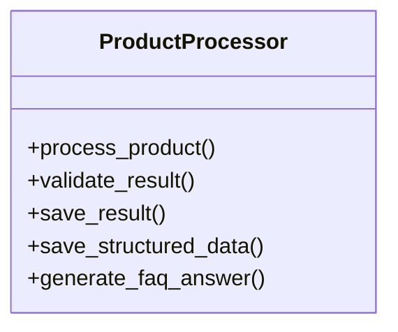
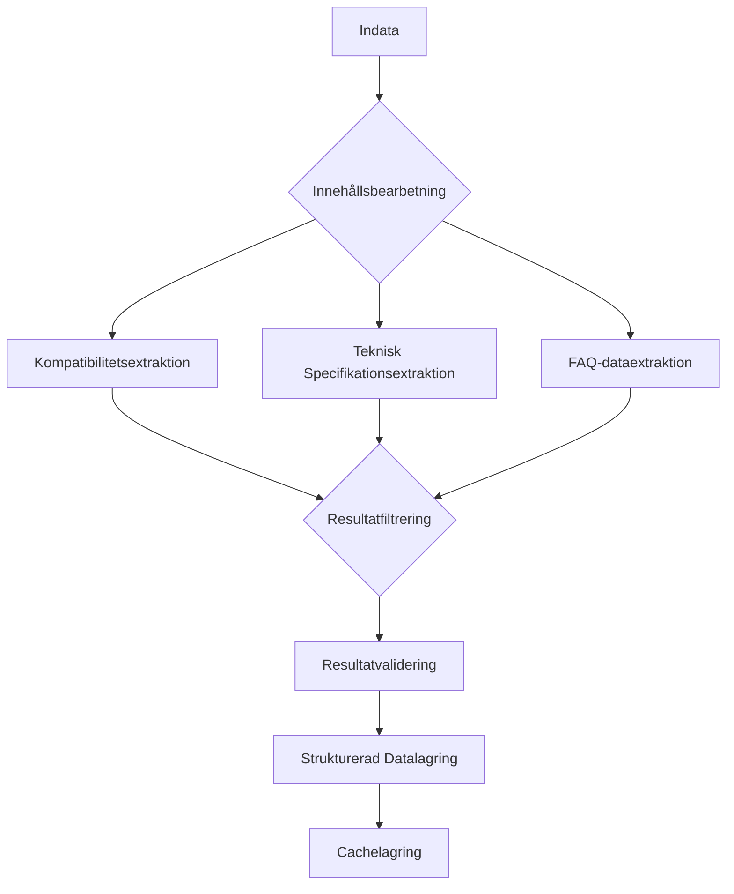
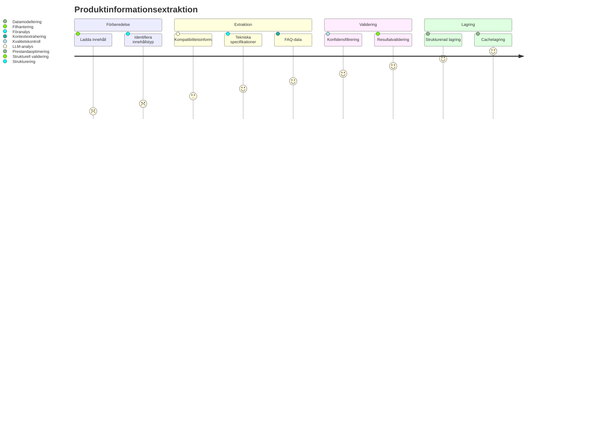

# Moduldokumentation för ProductProcessor

## Övergripande Systemöversikt

`ProductProcessor` är en central komponent i LLM-baserad produktinformationsextraktion som hanterar detaljerad bearbetning och strukturering av produktdata.

## Kärnkomponenter

### 1. Datastrukturer

#### ExtractionStatus
Representerar status för extraktionsprocessen:
- `NOT_STARTED`
- `IN_PROGRESS`
- `COMPLETED`
- `FAILED`
- `PARTIALLY_COMPLETED`
- `VALIDATED`
- `VALIDATION_FAILED`

#### ProductResult
Innehåller extraherad produktinformation:
- Produkt-ID
- Extraktionsstatus
- Kompatibilitetsinformation
- Tekniska specifikationer
- FAQ-data
- Fel och varningar
- Metadata

#### ValidationResult
Hanterar validering av extraherade resultat:
- Validitetsstatus
- Fel
- Varningar

### 2. Kärnfunktioner

#### Huvudmetoder
- `process_product()`: Huvudmetod för produktbearbetning
- `_process_content()`: Extraherar information från innehåll
- `validate_result()`: Validerar extraherade resultat
- `save_result()`: Sparar fullständigt resultat
- `save_structured_data()`: Sparar strukturerad data
- `generate_faq_answer()`: Genererar FAQ-svar

### 3. Avancerade Funktioner

#### Resultathantering
- Stöd för chunk-baserad bearbetning
- Resultatsammanslagning från olika källor
- Konfidensbaserad filtrering
- Cachehantering

#### Informationsextraktion
- Kompatibilitetsextraktion
- Teknisk specifikationsextraktion
- FAQ-dataextraktion
- Dynamisk promptvalda
- Konfigurerbar extraktionströskel

## Arkitektoniska Principer

1. **Flexibel Extraktion**
   - Konfigurerbar extraktionsprocess
   - Stöd för olika informationstyper
   - Dynamisk prompthantering

2. **Robust Datavalidering**
   - Strukturerad validering
   - Detaljerad felrapportering
   - Konfidensbaserad filtrering

3. **Minneseffektiv Bearbetning**
   - Stöd för chunk-baserad bearbetning
   - Resultatsammanslagning
   - Cachehantering

## Arbetsflödesstrategi

## Extensibility och Konfiguration

- Konfigurerbar extraktionsprocess
- Dynamisk prompthantering
- Anpassningsbara validerings- och filtreringsregler
- Stöd för olika informationstyper

## Prestandaöverväganden

- Parallell bearbetning av innehållsbitar
- Konfidensbaserad filtrering
- Minnesvänlig chunk-baserad bearbetning
- Cacheoptimering

## Säkerhetsaspekter

- Robust felhantering
- Validering av extraherade data
- Konfigurerbar konfidensfiltrering
- Detaljerad loggning

## Skalbarhetspotential

- Horisontell skalning genom chunk-bearbetning
- Dynamisk resursallokering
- Konfigurerbar extraktionsprocess
- Stöd för distribuerad bearbetning

--------

